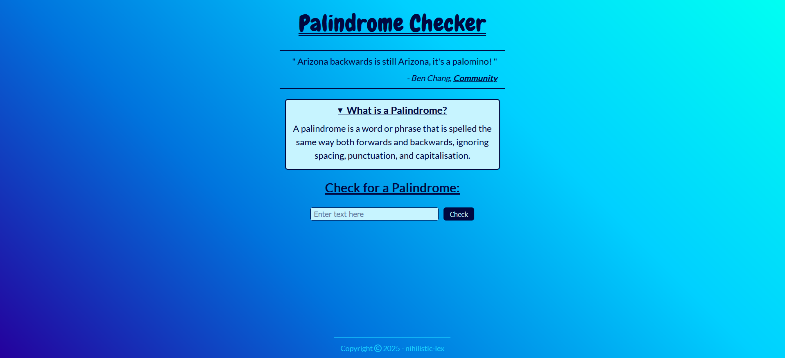

# Palindrome Checker

A browser-based palindrome checker built with HTML, CSS, and JavaScript.

This is the first project from freeCodeCamp's **JavaScript Algorithms and Data Structures** course.

## Features

- Removes special characters, punctuation, and spaces using regex
- Checks if the user input is the same backwards
- Displays results dynamically

## Preview

---

Created by [`<lexiCodes/>`](https://github.com/nihilistic-lex)
